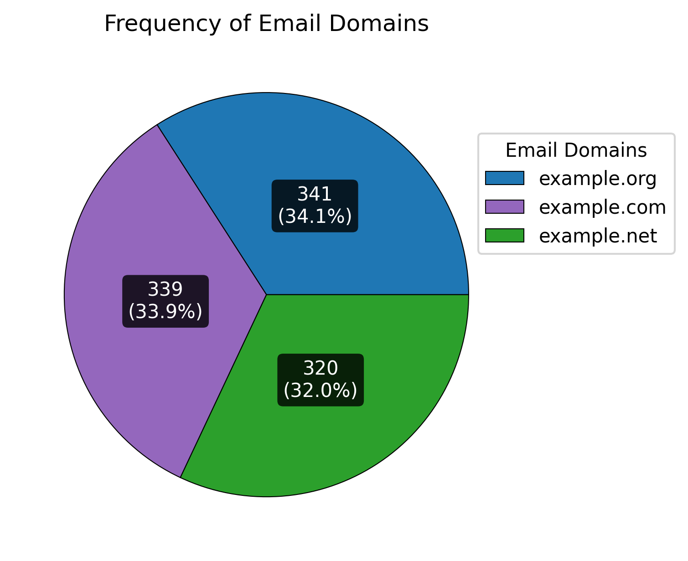
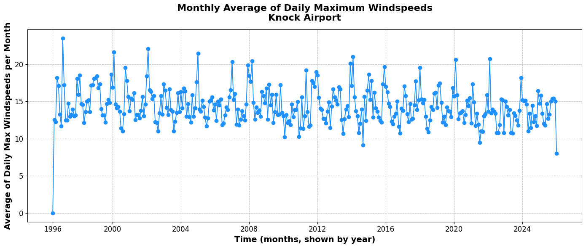

# Programming for Data Analytics

### Author
**Aldas Zarnauskas**

---

## Table of contents
* [Overview](#overview)
* [Assignments and Project Description](#assignments-and-project-description)
* [Requirements](#Requirements)
* [License](#License)
* [Reference](#Reference)

---

## Overview
This repository contains the assignments and project work for the **Programming for Data Analytics** module at **Atlantic Technological University, Galway**.  
The module is part of the *Level 8 Higher Diploma in Computational and Data Analytical Science* program.

The purpose of this repository is to organize and showcase coursework completed throughout the module. It includes Python-based assignments and a final project focused on data analytics techniques.

---

## Assignments and Project Description

### [Assignments](./assignments/)
1. **assignment02-bankholidays**  
   → [assignment02-bankholidays.py](assignments/assignment02-bankholidays.py)  
   Prints out the dates of bank holidays in Northern Ireland and identifies which ones are unique to Northern Ireland (i.e., not observed elsewhere in the UK).

2. **assignment03-pie**  
   → [assignment03-pie.ipynb](assignments/assignment03-pie.ipynb)  
   Generates a pie chart visualizing the distribution of email domains from a dataset of 1,000 people.

    Below is the pie chart generated by `assignment03-pie.ipynb`:

    

3. **assignment05-population**  
   → [assignment05-population.ipynb](assignments/assignment05-population.ipynb)  
   Loads population data by county and gender in Ireland, performs data cleaning and exploration, and visualises demographic distributions and trends across regions and sexes.

4. **assignment06-weather**  
   → [assignment06-weather.ipynb](assignments/assignment06-weather.ipynb)  
   Analyses historical weather data by loading, cleaning, and exploring temperature and rainfall patterns, then visualises trends and relationships to understand climate variations over time.

   Below is the time series plot of the monthly average of daily maximum windspeeds Knock airport generated by `assignment06-weather.ipynb`:

    

---

### [Project](./project/) Type 2 Diabetes Mellitus: Global Prevalence and Risk Factors


#### **Project Overview**
This project explores the global prevalence of Type 2 Diabetes (T2D) through exploratory data analysis.

#### **Introduction**
In this project, we will examine global prevalence patterns of Type 2 Diabetes (T2D) and its associated risk factors. T2D is one of the fastest-growing diseases worldwide. It is estimated that among adults 20-79, T2D had increased by 74 million from 463 in 2019 (9% of population according to 9th edition of the IDF reporting) to 537 million (10.5% population) in 2021. And it is projected to affect 783 million adults age 20-79 by 2045[^1]. This chronic condition impacts multiple organs, including the nerves, heart, kidneys, blood vessels, and eyes, significantly reducing quality of life and life expectancy[^2]. Consequently, T2D places a substantial burden on healthcare systems globally. Diabetes caused at least USD 1 trillion dollars in health expenditure – a 338% increase over the last 17 years[^3] and it should be the primary concern for the regions with high disease burden.
Hence, the goal of this project is to:
1. Analyse prevalence patterns of T2D worldwide to identify countries with the highest rates where interventions are most needed.
2. Investigate key risk factors contributing to T2D prevalence, that are most worth attention to reduce the prevalence of T2D, including:
    - Age, Low physical activity, High BMI[^4].
    - Consumption of sugar-sweetened beverages[^5].
    - Tabacco use[^6].

#### **Data Source**
For this project, we used statistically modelled estimates of T2D values and percentages, low physical activity, high BMI, consumption of SSBs, tabaco use statistics for 204 countries and territories, that are publicly accessible with Global Health Data Exchange's (GHDx) visualisation tools[^7], provided by the Institute for Health Metrics and Evaluation (IHME). GHDx offers a wide range of health-related datasets, including survey data, scientific study results, and statistically modeled estimates[^8].

We used T2D count values for the various age groups (<5, 5-9,  10-14, 15-19, 20-24, 25-29, 30-34, 35-39, 40-44, 45-49, 50-54, 55-59, 60-64, 65-69, 70-74, 75-79, 80-84, 85-89, 90-94, 95>) in 2023. We also used the population estimates in all those countries and age groups in 2023. Furthermore, we used age-standardised T2D, low physical activity, high BMI, tabaco usage, and high consumption of SSBs prevalence percentage and rates spanning from 1990-2023.

#### **Methods**  
To identify trends and risk factors, we utilise the following analytical tools:  
- Exploratory Analysis: Age as a Risk Factor for Type 2 Diabetes Mellitus
- Exploratory Analysis: Age-Standardisation and Global Comparison
  Choropleth: Visualizing Global Prevalence
  Scatter ploth: T2D values Man vs Females
  Line ploth: Regions
- Risk Factors of Type 2 Diabetes
  Multiple Regression Analysis

#### Results
**Exploratory Analysis: Age as a Risk Factor for Type 2 Diabetes Mellitus**  

[Figure 1. Age as a Risk Factor for Type 2 Diabetes Mellitus](./plots/T2D_preva_2023_regions.png)
*Figure 1. The percentage T2D prevalence in 2023 in different geophraphical regions over various age groups.*

**Exploratory Analysis: Age-Standardisation and Global Comparison**  
   **Choropleth: Visualizing Global Prevalence**  

   [Figure 2. The percentage of T2D prevalence on choropleth in 2023](./plots/T2D_preva_2023_choropleth.png)
   *Figure 2. The percentage of age-standardised T2D prevalence in 2023 on a choropleth.*

   **Scatter ploth: T2D values Man vs Females**  

   [Figure 3. The percentage of T2D prevalence man vs females in 2023](./plots/T2D_preva_2023_scatter.png)
   *Figure 3. Males vs Female percentage of age-standardised T2D prevalence in 2023 on a scatterploth.*

   **Line ploth: Regions** 

   [Figure 4. Line ploth: Regions](./plots/T2D_preva_1990-2023.png)
   *Figure 4. The percentage of age-standardised T2D prevalence in 2023 on choropleth.*
 
**Risk Factors of Type 2 Diabetes**  
   **Multiple Regression Analysis**  


#### Conclusion


---

## Requirements
Dependencies for this project are listed in [requirements.txt](requirements.txt).  
To install them, run:

```bash
pip install -r requirements.txt
```

---

## License  
No license specified.

---

## Reference 
[^1]: Sun H, Saeedi P, Karuranga S, et al. IDF Diabetes Atlas: Global, regional and country-level diabetes prevalence estimates for 2021 and projections for 2045. Diabetes Res Clin Pract. 2022;183:109119. doi:10.1016/j.diabres.2021.109119    
[^2]: Chen, X., Zhang, L. & Chen, W. Global, regional, and national burdens of type 1 and type 2 diabetes mellitus in adolescents from 1990 to 2021, with forecasts to 2030: a systematic analysis of the global burden of disease study 2021. BMC Med 23, 48 (2025). https://doi.org/10.1186/s12916-025-03890-w    
[^3]: International Diabetes Federation. *IDF Diabetes Atlas*. 11th ed. Brussels, Belgium: International Diabetes Federation; 2025. https://diabetesatlas.org/    
[^4]: National Institute of Diabetes and Digestive and Kidney Diseases. Risk Factors for Type 2 Diabetes. Updated October 2024. https://www.niddk.nih.gov/health-information/diabetes/overview/risk-factors-type-2-diabetes  
[^5]: Lara-Castor, L., O’Hearn, M., Cudhea, F. et al. Burdens of type 2 diabetes and cardiovascular disease attributable to sugar-sweetened beverages in 184 countries. Nat Med 31, 552–564 (2025). https://doi.org/10.1038/s41591-024-03345-4   
[^6]: World Health Organization. Diabetes. Fact sheet. Updated November 2024. https://www.who.int/news-room/fact-sheets/detail/diabetes    
[^7]: Institute for Health Metrics and Evaluation (IHME). GBD Results Tool. Seattle, WA: IHME, University of Washington; 2025.  https://vizhub.healthdata.org/gbd-results/   
[^8]: Institute for Health Metrics and Evaluation (IHME). Global Health Data Exchange (GHDx).  https://ghdx.healthdata.org/  
