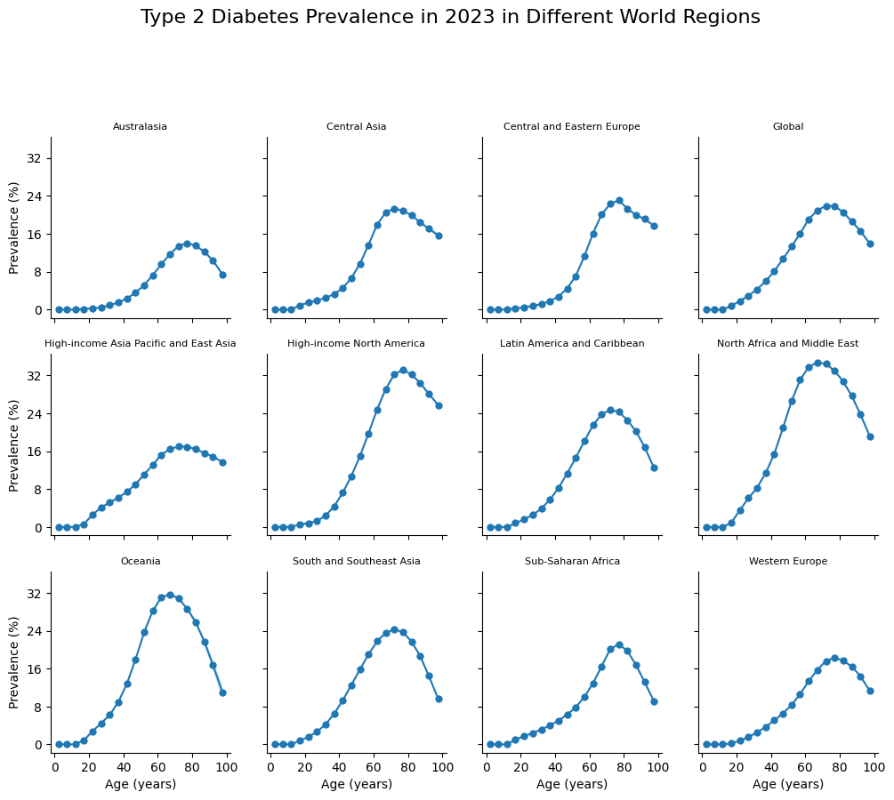
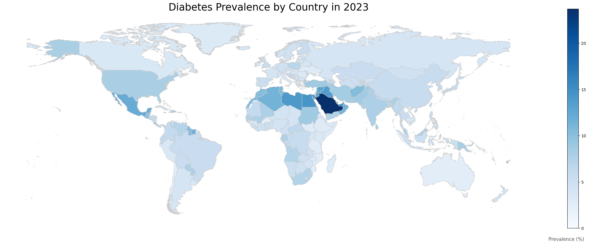
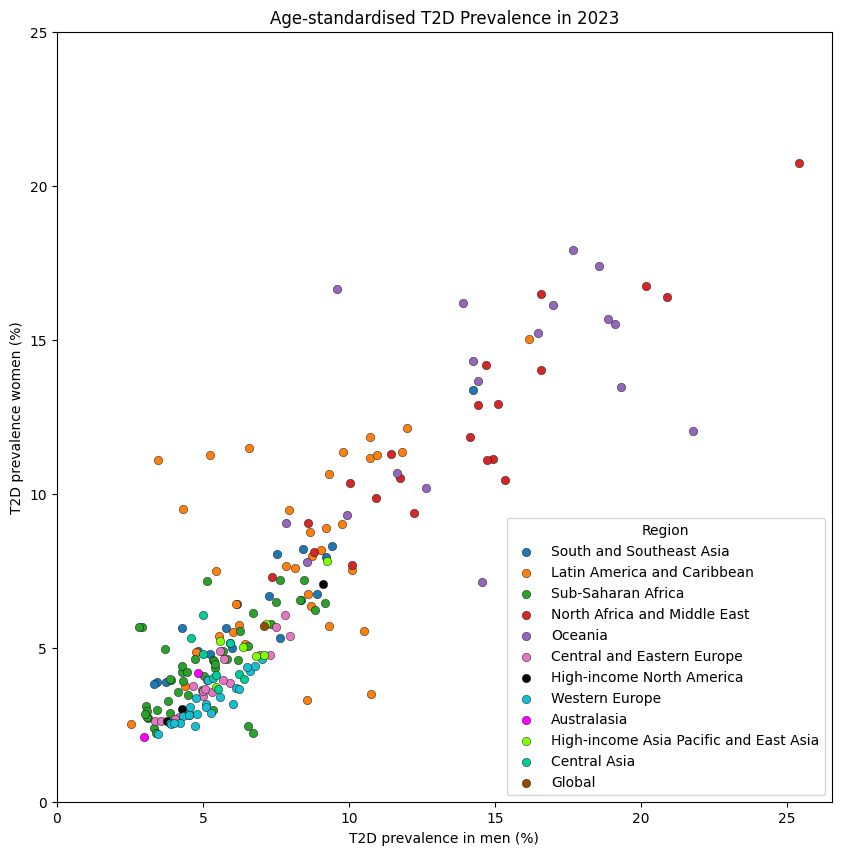
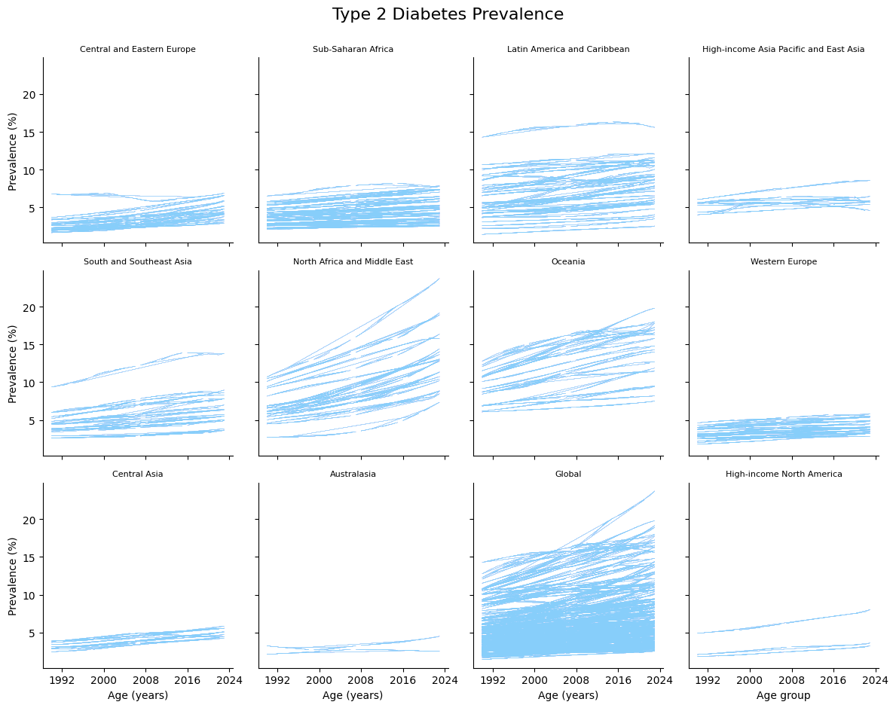
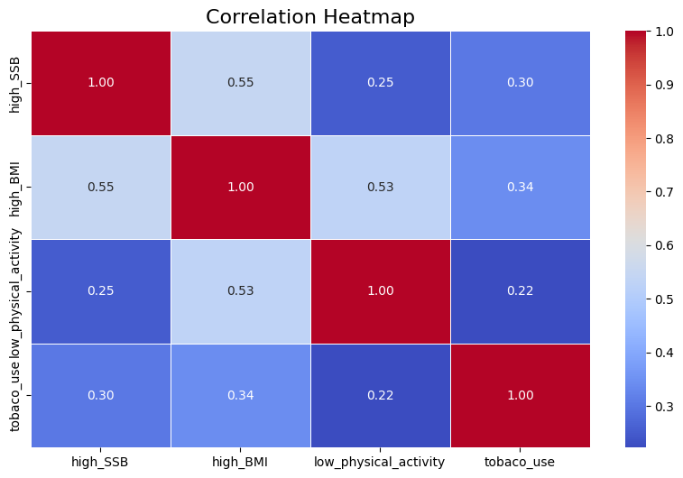

# Programming for Data Analytics

### Author
**Aldas Zarnauskas**

---

## Table of Contents
* [Overview](#overview)
* [Assignments](#assignments)
* [Project — Type 2 Diabetes Mellitus: Global Prevalence and Risk Factors](#project--type-2-diabetes-mellitus-global-prevalence-and-risk-factors)
  * [Project Overview](#project-overview)
  * [Introduction](#introduction)
  * [Data Source](#data-source)
  * [Methods](#methods)
  * [Results](#results)
  * [Conclusion](#conclusion)
* [Repository Structure](#repository-structure)
* [How to Run Locally](#how-to-run-locally)
* [Requirements](#requirements)
* [License](#license)
* [References](#references)

---

## Overview

This repository contains the assignments and project work for the **Programming for Data Analytics** module at **Atlantic Technological University, Galway**.
The module is part of the *Level 8 Higher Diploma in Computational and Data Analytical Science* program.

The purpose of this repository is to organize and showcase coursework completed throughout the module. It includes Python-based assignments and a final project focused on data analytics techniques.

---

## Assignments

The assignments are located in the [`assignments/`](./assignments/) folder.

1. **assignment02-bankholidays**
   → [assignment02-bankholidays.py](assignments/assignment02-bankholidays.py)
   Prints out the dates of bank holidays in Northern Ireland and identifies which ones are unique to Northern Ireland (i.e., not observed elsewhere in the UK).

2. **assignment03-pie**
   → [assignment03-pie.ipynb](assignments/assignment03-pie.ipynb)
   Generates a pie chart visualizing the distribution of email domains from a dataset of 1,000 people.

   Below is the pie chart generated by `assignment03-pie.ipynb`:

   

3. **assignment05-population**
   → [assignment05-population.ipynb](assignments/assignment05-population.ipynb)
   Loads population data by county and gender in Ireland, performs data cleaning and exploration, and visualises demographic distributions and trends across regions and sexes.

4. **assignment06-weather**
   → [assignment06-weather.ipynb](assignments/assignment06-weather.ipynb)
   Analyses historical weather data by loading, cleaning, and exploring temperature and rainfall patterns, then visualises trends and relationships to understand climate variations over time.

   Below is the time series plot of the monthly average of daily maximum windspeeds at Knock airport, generated by `assignment06-weather.ipynb`:

   

---

## Project — Type 2 Diabetes Mellitus: Global Prevalence and Risk Factors

### Project Overview

This project explores the global prevalence of Type 2 Diabetes (T2D) through exploratory data analysis.

### Introduction

In this project, we examine global prevalence patterns of Type 2 Diabetes (T2D) and its associated risk factors. T2D is one of the fastest-growing diseases worldwide. It is estimated that among adults aged 20–79, T2D increased by 74 million — from 463 million in 2019 (9% of the population according to the 9th edition of the IDF reporting) to 537 million (10.5% of the population) in 2021. It is projected to affect 783 million adults between ages 20–79 by 2045[^1]. This chronic condition impacts multiple organs, including the nerves, heart, kidneys, blood vessels, and eyes, significantly reducing quality of life and life expectancy[^2]. Consequently, T2D places a substantial burden on healthcare systems globally. Diabetes caused at least USD 1 trillion dollars in health expenditure — a 338% increase over the last 17 years[^3] — and it should be the primary concern for the regions with the highest disease burden.

Hence, the goals of this project are to:
1. Analyse prevalence patterns of T2D worldwide to identify countries with the highest rates where interventions are most needed.
2. Investigate key risk factors contributing to T2D prevalence, including:
   - Age, low physical activity, high BMI[^4].
   - Consumption of sugar-sweetened beverages[^5].
   - Tobacco use[^6].

### Data Source

For this project, we used statistically modelled estimates of T2D values and percentages, low physical activity, high BMI, consumption of SSBs, and tobacco use statistics for 204 countries and territories, that are publicly accessible with Global Health Data Exchange's (GHDx) visualisation tools[^7], provided by the Institute for Health Metrics and Evaluation (IHME). GHDx offers a wide range of health-related datasets, including survey data, scientific study results, and statistically modelled estimates[^8].

We used T2D count values for various age groups (<5, 5–9, 10–14, 15–19, 20–24, 25–29, 30–34, 35–39, 40–44, 45–49, 50–54, 55–59, 60–64, 65–69, 70–74, 75–79, 80–84, 85–89, 90–94, 95+) in 2023. We also used the population estimates in all those countries and age groups in 2023. Furthermore, we used age-standardised T2D, low physical activity, high BMI, tobacco usage, and high consumption of SSBs prevalence percentage and rates spanning from 1990–2023.

### Methods

To identify trends and risk factors, we utilise the following analytical tools:

- **Exploratory Analysis: Age as a Risk Factor for Type 2 Diabetes Mellitus**
- **Exploratory Analysis: Age-Standardisation and Global Comparison**
  - Choropleth: Visualising global prevalence
  - Scatter plot: T2D values — males vs females
  - Line plot: Regions
- **Risk Factors of Type 2 Diabetes**
  - Correlation analysis of risk factors
  - Variance Inflation Factor analysis of independent variables
  - Multiple regression analysis

### Results

**Exploratory Analysis: Age as a Risk Factor for Type 2 Diabetes Mellitus**

Figure 1 shows that T2D prevalence is consistently higher in older age groups across all represented geographical regions. This trend highlights the need to age-standardise T2D values for more accurate country-to-country and region-to-region comparisons. Prevalence typically begins to increase at age 20, reaches its peak at age 70, and interestingly, begins to decline thereafter.


*Figure 1. The percentage T2D prevalence in 2023 in different geographical regions over various age groups.*


**Exploratory Analysis: Age-Standardisation and Global Comparison**

**Choropleth: Visualising Global Prevalence**

Figure 2 highlights higher prevalence rates in the Middle East, North Africa, the Caribbean, and parts of Oceania. Countries in these regions appear in the darkest shades, indicating the highest percentage of the population living with Type 2 Diabetes. Conversely, relatively lower rates are visible across parts of Sub-Saharan Africa and Eastern Europe.


*Figure 2. The percentage of age-standardised T2D prevalence in 2023 on a choropleth.*

The highest T2D prevalence is observed in Oceania, Latin America and the Caribbean, and North Africa and the Middle East. Conversely, regions such as Sub-Saharan Africa and Eastern and Central Europe exhibit the lowest prevalence. While T2D rates are relatively similar between females and males in most countries, notable gender disparities emerge in the high-prevalence regions mentioned above, where certain countries show significant differences between the sexes.

**Scatter Plot: T2D Values — Males vs Females**


*Figure 3. Males vs female percentage of age-standardised T2D prevalence in 2023 on a scatter plot.*

**Line Plot: Regions**

Figure 4 shows a consistent upward trajectory in the prevalence of T2D over the last three decades. Globally, the number of people living with T2D has more than doubled since 1990, reflecting a transition from a relatively less common condition to a major global health epidemic.


*Figure 4. The percentage of age-standardised T2D prevalence in geographical world regions between 1990–2023.*


**Risk Factors of Type 2 Diabetes**

**Multiple Regression Analysis**

The diagnostic results from Correlation Analysis (Figure 5) indicate no severe pairwise multicollinearity, as all coefficients remain below the 0.6 threshold. This suggests that there are no redundant variables. In contrast, the Variance Inflation Factor analysis (Table 1) shows moderate multicollinearity for low physical activity (VIF = 5.75) and tobacco use (VIF = 5.31). Interestingly, high BMI (VIF = 9.89) is close to the high-risk threshold of 10. This means that high BMI has substantial multicollinearity with other variables that can affect the following Multiple Regression Analysis.

The Multiple Regression Analysis (Table 2) confirms that all risk factors are statistically significant (p < 0.05) with T2D. High BMI has the most influence on the T2D value. For every 1% increase in the high BMI rate, T2D prevalence increases by approximately 0.16%. Notably, tobacco use and high SSB have negative estimates. These results contradict the findings from the literature which identifies these two factors as risk factors for T2D. This discrepancy is likely caused by the high VIF of BMI (9.9). It means that high BMI likely absorbs all the predictive power of the two latter factors, thus making them negative. Therefore, the negative estimates of tobacco use and high SSB should be interpreted as the result of multicollinearity rather than as protective factors against T2D.


*Figure 5. The correlation matrix shows correlation scores between the independent variables: high SSB, high BMI, low physical activity, tobacco use.*

**Table 1. Variance Inflation Factors of the Independent Variables**

| Rank | Feature                 | VIF    |
|------|-------------------------|--------|
| 1    | high_BMI                | 9.8894 |
| 2    | low_physical_activity   | 5.7468 |
| 3    | tobacco_use             | 5.3144 |
| 4    | high_SSB                | 3.2083 |

**Table 2. Multiple Regression Estimates of the Independent Variables**

| Parameter             | Estimate | Std. Err. | T-stat  | P-value | Lower CI | Upper CI |
| --------------------- | -------- | --------- | ------- | ------- | -------- | -------- |
| Intercept             | 1.7927   | 0.0887    | 20.215  | 0.0000  | 1.6189   | 1.9665   |
| high_SSB              | -0.0429  | 0.0028    | -15.430 | 0.0000  | -0.0483  | -0.0374  |
| high_BMI              | 0.1647   | 0.0039    | 42.219  | 0.0000  | 0.1571   | 0.1724   |
| low_physical_activity | 0.1485   | 0.0034    | 43.969  | 0.0000  | 0.1418   | 0.1551   |
| tobacco_use           | -0.0717  | 0.0034    | -21.381 | 0.0000  | -0.0782  | -0.0651  |

### Conclusion

In this project, we identified age as a key risk factor for T2D, with prevalence beginning to rise at age 20, peaking at age 70, and declining thereafter in 2023. Furthermore, the countries with the highest T2D prevalence in 2023 are located in Oceania, Latin America and the Caribbean, and North Africa and the Middle East. Conversely, regions such as Sub-Saharan Africa and Eastern and Central Europe exhibit the lowest prevalence. While T2D rates are relatively similar between females and males in most countries, notable gender disparities emerge in the high-prevalence regions mentioned above, where certain countries show substantial differences between the sexes. In addition, Figure 4 demonstrates a consistent upward trajectory in T2D prevalence over the last three decades, reflecting a transition from a less common condition to a major global health epidemic. Meanwhile, Multiple Regression Analysis reveals that high BMI and low physical activity are the most influential risk factors affecting T2D prevalence.

---

## Repository Structure

* **`assignments/`** – Assignment notebooks and scripts for the module.
* **`data/`** – Datasets used by the assignments and the project.
* **`plots/`** – All generated visualisations (pie charts, scatter plots, choropleths, etc.).
* **`project/`** – The Type 2 Diabetes project notebook and supporting files.
* **`requirements.txt`** – Python dependencies.

---

## How to Run Locally

Requires **Python 3.10+**.

1. Clone the repository:
   ```bash
   git clone https://github.com/aldaszarnauskas/programming-for-data-analytics.git
   cd programming-for-data-analytics
   ```

2. Install dependencies:
   ```bash
   pip install -r requirements.txt
   ```

3. Open the assignments or project notebooks:
   ```bash
   jupyter notebook
   ```

---

## Requirements

Dependencies are listed in [requirements.txt](requirements.txt).
To install them, run:

```bash
pip install -r requirements.txt
```

---

## License

This project is licensed under the MIT License — see the [LICENSE](LICENSE) file for details.

---

## References

[^1]: Sun H, Saeedi P, Karuranga S, et al. IDF Diabetes Atlas: Global, regional and country-level diabetes prevalence estimates for 2021 and projections for 2045. Diabetes Res Clin Pract. 2022;183:109119. doi:10.1016/j.diabres.2021.109119
[^2]: Chen, X., Zhang, L. & Chen, W. Global, regional, and national burdens of type 1 and type 2 diabetes mellitus in adolescents from 1990 to 2021, with forecasts to 2030: a systematic analysis of the global burden of disease study 2021. BMC Med 23, 48 (2025). https://doi.org/10.1186/s12916-025-03890-w
[^3]: International Diabetes Federation. *IDF Diabetes Atlas*. 11th ed. Brussels, Belgium: International Diabetes Federation; 2025. https://diabetesatlas.org/
[^4]: National Institute of Diabetes and Digestive and Kidney Diseases. Risk Factors for Type 2 Diabetes. Updated October 2024. https://www.niddk.nih.gov/health-information/diabetes/overview/risk-factors-type-2-diabetes
[^5]: Lara-Castor, L., O'Hearn, M., Cudhea, F. et al. Burdens of type 2 diabetes and cardiovascular disease attributable to sugar-sweetened beverages in 184 countries. Nat Med 31, 552–564 (2025). https://doi.org/10.1038/s41591-024-03345-4
[^6]: World Health Organization. Diabetes. Fact sheet. Updated November 2024. https://www.who.int/news-room/fact-sheets/detail/diabetes
[^7]: Institute for Health Metrics and Evaluation (IHME). GBD Results Tool. Seattle, WA: IHME, University of Washington; 2025. https://vizhub.healthdata.org/gbd-results/
[^8]: Institute for Health Metrics and Evaluation (IHME). Global Health Data Exchange (GHDx). https://ghdx.healthdata.org/
